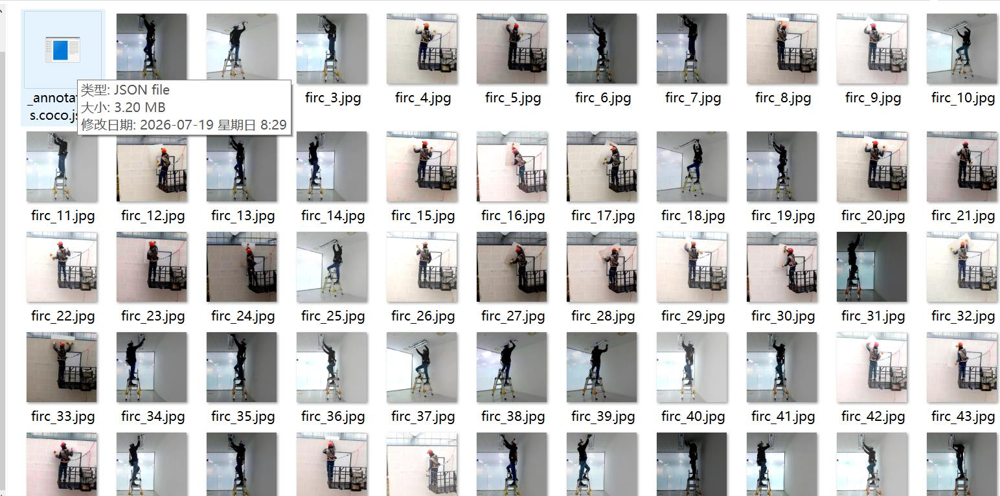
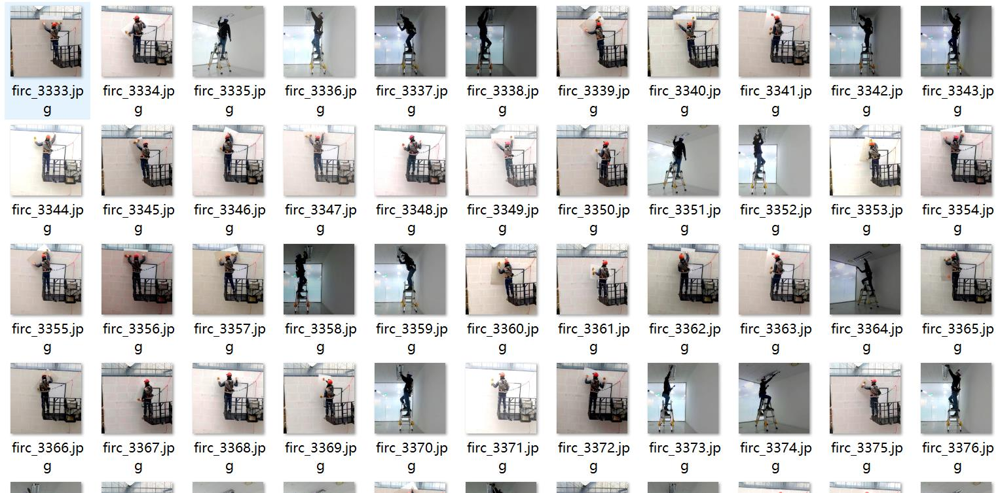
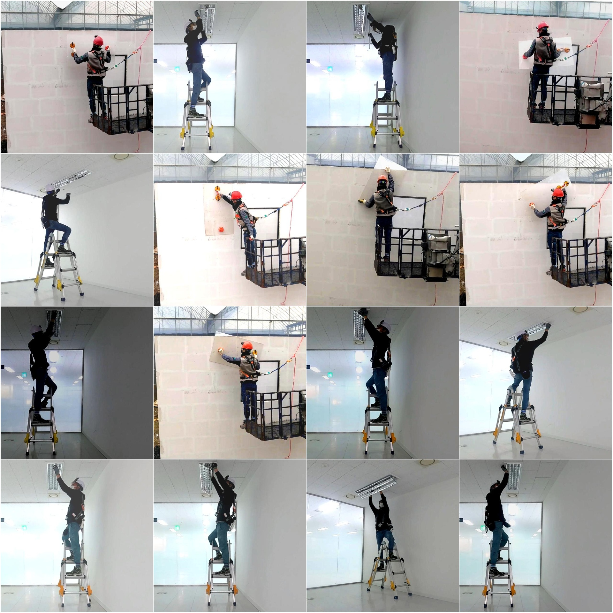

# Indoor Decoration Workers Posture Detection Dataset in COCO+YOLO Format with 5040 Images and 2 Categories

Dataset Format: YOLO keypoint format (note that this is not the target detection or segmentation YOLO format, it only includes JPG images and corresponding YOLO format TXT files)
Number of Image Files (JPG files): 5040
Number of TxT Files (Keypoint annotations): 5040
Training Set Size: 4800
Validation Set Size: 120
Testing Set Size: 120
Number of Categories: 2
Category Names: ['Lifting', 'Overhead']
Number of Keypoints: 16
Keypoint Names: ["Head", "Neck", "Right-shoulder", "Right-elbow", "Right-wrist", "Right-hand", "Left-shoulder", "Left-elbow", "Left-wrist", "Left-hand", "Left-hip", "Right-hip", "Right-knee", 
"Right-foot", "Left-knee", "Left-foot"]
Box Count per Category:
Lifting (Hand lifting task) Box count = 2520
Overhead (Superhead task) Box count = 2520
Total Box Count = 5040
Image Resolution: 640x640
Important Notice: The dataset has been split into training, validation, and testing sets, which can be directly used for training models using YOLOv5-pose, YOLOv8-pose, YOLOv11-pose, or YOLOv26-pose.
Special Remark: This dataset does not guarantee the accuracy of the trained model or weight files.
Image Preview:
Annotation Example:
Randomly selected 16 images (example):
Annotation drawing result:

## Images

Here is a pay link on Stripe ( https://buy.stripe.com/3cs8yP7sY87d0vu9AB ). Please contact me lonlonago@foxmail.com after funding $89, and I will send you a complete data files , thank you!

